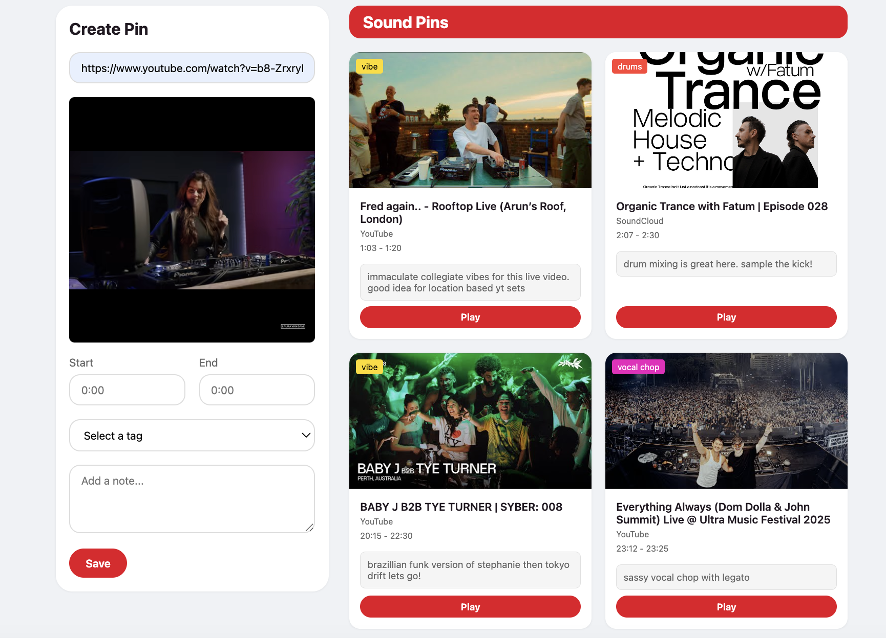

# Referencr

Referencr is Pinterest for sounds! It helps music producers save and organize specific timestamps from YouTube and SoundCloud tracks.

Try it here https://referencr-lrff.vercel.app/ 

## Features

### Multi-Platform Support
- 🎥 YouTube/YouTube Music support
- 🎵 SoundCloud support
- Automatic platform detection from URLs

### Rich Pin Organization
- 🏷️ Color-coded tags for high level clip information
- 📝 Optional notes so you remember why you clipped it!
- 🖼️ Thumbnail preview for each saved clip

## How to Use

1. **Add Media**
   - Paste a YouTube, YouTube Music, or SoundCloud URL
   - Wait for the media to load

2. **Create a Pin**
   - Set start time (e.g., "1:30")
   - Set end time (e.g., "2:45")
   - Select a tag (optional)
   - Add a note (optional)
   - Click "Save Pin"

3. **Play Saved Clips**
   - Click the "Play Clip" button on any saved pin
   - Playback will automatically stop at the specified end time
   - Switch between different platforms seamlessly

## Note

This is a client-side only application. All pins are saved in your browser's local storage.
